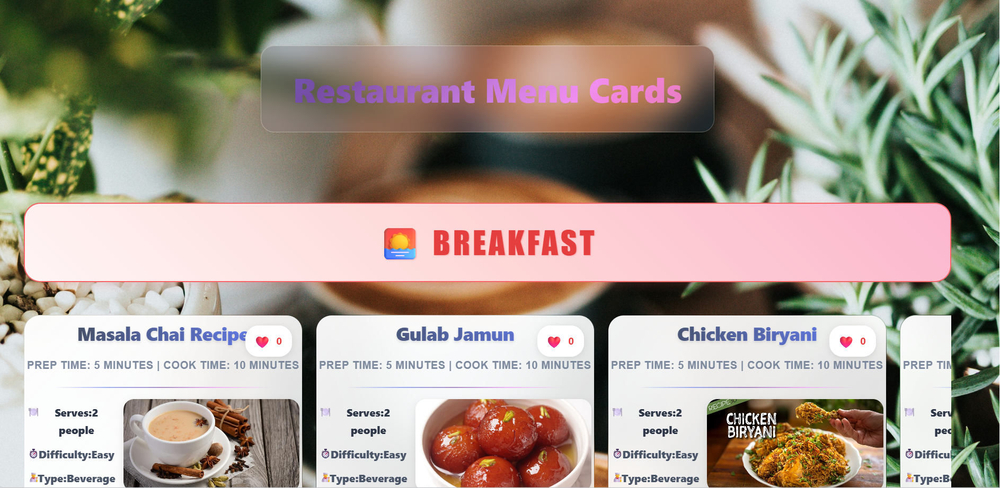
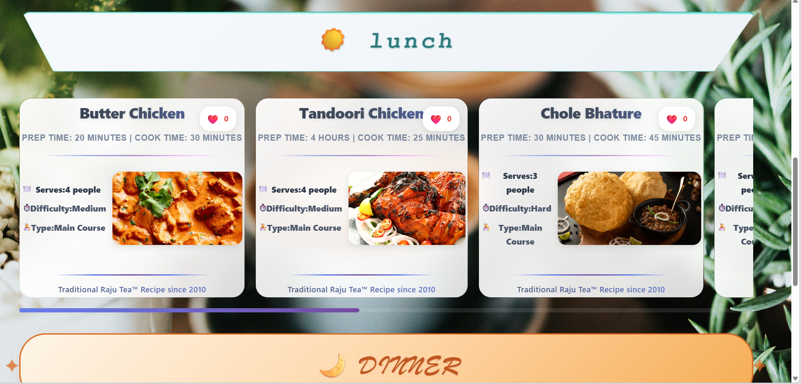
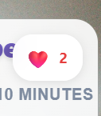

# Restaurant Menu Application 🍽️

A dynamic and interactive restaurant menu web application built with React and Vite, featuring categorized recipe cards with modern UI design.

## 🚀 Live Demo
View the live application: [Restaurant Menu App](#) <!-- Add your deployment link here -->

## 📸 Screenshots

### Application Overview - Breakfast Section

*Beautiful breakfast menu with gradient background and interactive recipe cards featuring Masala Chai, Gulab Jamun, and Chicken Biryani*

### Lunch & Dinner Sections

*Main course items including Butter Chicken, Tandoori Chicken, and Chole Bhature with detailed preparation times and difficulty levels*

### Interactive Like System

*Real-time heart-shaped like buttons with counter functionality - users can interact with each recipe card*

## 📋 Features

- **Dynamic Menu Categories**: Recipes organized into Breakfast, Lunch, and Dinner sections
- **Interactive Recipe Cards**: Each card displays recipe details with preparation time, serving size, and difficulty level
- **Like System**: Interactive heart-shaped like buttons with real-time counters
- **Responsive Design**: Mobile-friendly interface with organized card layouts
- **Rich Recipe Database**: 20+ traditional Indian cuisine recipes with high-quality images

## 🛠️ Technologies Used

- **Frontend**: React 19, JavaScript (ES6+)
- **Build Tool**: Vite 7.1.4
- **Styling**: CSS3 with custom designs
- **State Management**: React Hooks (useState)
- **Architecture**: Component-based with props system

## 📦 Installation & Setup

1. **Clone the repository**
   ```bash
   git clone <your-repo-url>
   cd restorent
   ```

2. **Install dependencies**
   ```bash
   npm install
   ```

3. **Run development server**
   ```bash
   npm run dev
   ```
   Open [http://localhost:5173](http://localhost:5173) to view it in the browser.

4. **Build for production**
   ```bash
   npm run build
   ```

## 📁 Project Structure

```
restorent/
├── src/
│   ├── assets/          # Images and static files
│   ├── data.js          # Recipe database
│   ├── main.jsx         # Main app component with filtering logic
│   ├── Reciepes.jsx     # Individual recipe card component
│   ├── App.css          # Component styles
│   └── index.css        # Global styles
├── dist/                # Production build files
├── public/              # Public assets
└── package.json         # Dependencies and scripts
```

## 🎯 Key Components

- **Cards Component**: Main container with filtering logic for meal categories
- **App Component (Recipe Card)**: Reusable card component with like functionality
- **Data Module**: Comprehensive recipe database with detailed information

## 🍳 Recipe Categories

- **Breakfast**: Traditional morning dishes like Poha, Masala Chai
- **Lunch**: Main course items including Butter Chicken, Biryani
- **Dinner**: Evening specialties and desserts

## 🤝 Contributing

1. Fork the project
2. Create your feature branch (`git checkout -b feature/AmazingFeature`)
3. Commit your changes (`git commit -m 'Add some AmazingFeature'`)
4. Push to the branch (`git push origin feature/AmazingFeature`)
5. Open a Pull Request

## 📝 License

This project is open source and available under the [MIT License](LICENSE).

## 👨‍💻 Developer

Developed by **Raju** - [GitHub Profile](#) <!-- Add your GitHub profile link -->

---

⭐ Star this repository if you found it helpful!
